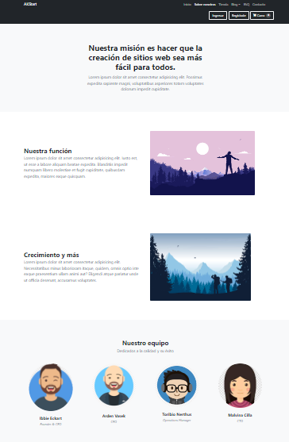
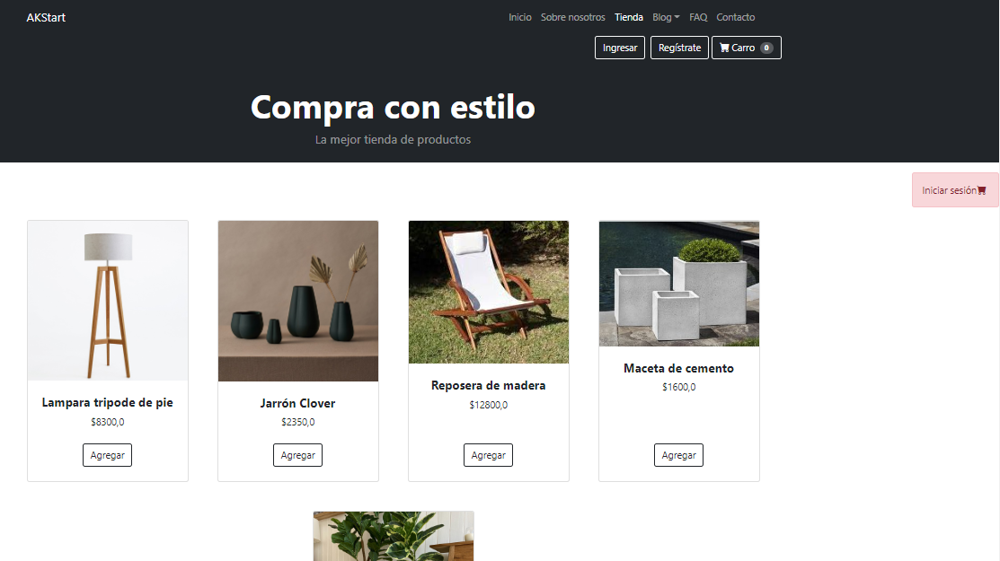
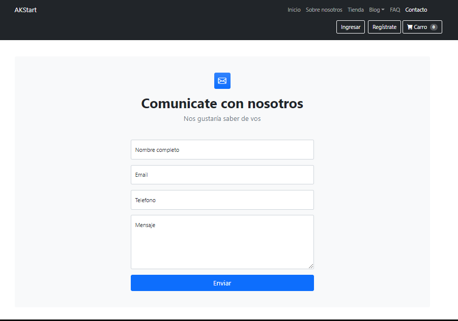

# Proyecto Web con Django

## Requisitos:
  * Django 2.2
  * Python 3

## Instalación
```
git clone https://github.com/anakloss/django-web.git
cd PagWeb
pip install -r requirements.txt
python manage.py runserver
```

## Descripción:
Proyecto web realizado con Python 3, Django, CSS y HTML.

### Inicio
  Pág de inicio con descripción de la empresa.
### Sobre Nosotros
  Pág que describe los servicios presentados y el equipo. Éstos son ingresados desde el Panel de administrador de Django.
  
### Tienda
  Descripción de los productos a la venta y gestión de pedidos, carrito, envio de email, etc. Gestionado desde Panel de administrador de Django.
  
### Contacto
  Formulario de contacto y envio de email.
  
### Autorización
  Gestión de autorización. Página de login o registro a través de cuenta Google.
